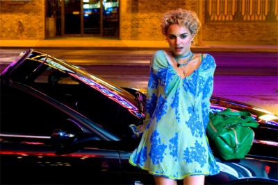

                                Merci Sky', bien moisi ton nouveau design. D'autres bonnes idées comme ça ?

120 cm, moins à l'étroit
24/24, juste trop bon
J'suis bientôt à 69 articles, j'suis donc en pleine méditation sur le futur nom de mon futur blog.
J'ai pensé à anaisdu31 mais bon j'trouve ça trop marginal.
J'ai pas fait d'article sur la fin de la 506 ni sur toutes les personnes qui m'ont tenu à coeur cette année parce qu'au fond elles le savent (et vous ça vous frustre de pas savoir ahah).
Mis à part ça, la fête du lycée on s'en branle, la ratatouille géante ça va être fun (ou pas), après la victoire de Sarko celle de Julien (où va la France), la tarto citron c'est bon, le tour du lac zizi au vent j'aurais pas cru, le poker c'est fashion et les spartiates aussi (cherchez l'erreur).
            
