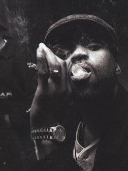

                                - Qu'est-ce que tu aimes ? M'incruster dans une converse intérressante, être calé avec des vrais, savourer cocktail de fruits ou chocolat chaud selon la saison, écrire, me promener en vago avec mon Riké, mater Lost avec Vins...
- Qu'est-ce que t'aimes pas ? Quand ça critique sans connaître(sur les choses, pas le gens parce que ça...moi aussi j'le fais), le galèrage du bus en retard, ceux qui dramatisent tout...

- Qu'est-ce que t'aimerais ? M'envoler pour le Brésil, les Etats-Unis, le Maroc, le Japon, l'Italie ou même le Sénégal une nouvelle fois. Que ma Maman éclate de rire un peu plus souvent. Un pull Ralph Lauren.
- C'est quand ton anif ? 23 Janvier, date désormais ancrée dans l'histoire.
- Qui t'aimerais rencontrer ou voir ? Medine(ou tout autre artiste sachant ECRIRE DES VERITES). Sofia Coppola.
- C'est qui ceux là ? Oula tu m'fais d'la peine là.
 
- Te cultives-tu ? Encore heureux.
- Qu'as tu fais à l'école ? J'y ai réussi sans effort. Et j'm'y suis tapée des barres de rire aussi, mais c'est à ça que ça sert le collège nan ?

- Es-tu déjà tombée amoureuse ? Oui, et c'était juste trop beau.
- Que ferais-tu par amour ? Supplier quelqu'un de me laisser le vivre(sachant que j'ai pas mal de fierté).
- Qui passe avant tout ? My people.

- Crois-tu en la chance ? Ohhh voui, et plutôt 2 fois qu'une, jusque là elle s'est pas trop éloignée de moi.
- As-tu un porte bonheur ? Ma main de Fatma. Un anneau 😊.

- Es-tu sincère avec ton entourage ou d'autres personnes ? Dans mes sentiments pour eux, voui.
- Si on te fait un coup de pute, que fais-tu ? Essaie pour voir.
- Décris moi ta personalité : Deux facettes : une soft qui aime la musique planante, le kawaï, les dessins animés, les jolies histoires et les couleurs. Une autre, plus "hardcore", qui garde ancrés Bruce Lee et Sangoku, les mangas de sport ou de baston, le rap gamberge et des expressions pas toujours agréables...
Sinon calme, loyale, rancunière, réfléchie...

- Quelles sont tes résolutions pour l'année 2007 ? Vivre encore jusqu'à 2008 et refaire ce même souhait. Cesser toute forme d'hypocrisie(je suis en bonne voie).
- Quel est ton plus grand rêve ? si un jour il se réalise, promis, vous le saurez.
            
