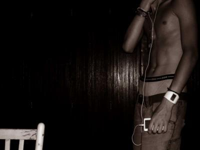

                                 Ô toi galèrien du net, venant buller sur mon modeste(ou pas) blog en quête d'un avenir meilleur. Ne mens pas, je sais que tu m'aimes. Avoues-le ou j'demande à Matt Po' de faire caca dans ton lit"un conseil, avoues".
Quoi ?! Ma vanne ne fait pas trésaillir tes zygomatiques"en cas de difficultés de compréhension, tu peux consulter ton petit Larousse" ?
Ingrat. 
Je blogue pour le bien de l'humanité et même pas un sourire en remerciement. 
Dieu punit les méchants, tache de t'en souvenir ! 
Mouahahahahahahah.
BREF.
Depuis environ un mois et demi, mon talent embelli la toile, vos yeux brillent devant mes mots et votre envie de me ressembler devient oppressante"mais n'ayez pas trop d'espoir".
Sk*yblog se divise d'ailleurs en 2 catégories, les blogs à chier et...le mien.
"ultra giga mega LOL, si vous saviez le nombre de plumes talentueuses sur le net...Nostalgeek, tu en fait partie"
J'eus envie de m'auto-aduler l'espace d'un instant et je sais que tu as joui  à la simple lecture de mon ego trip. 

Je ne sais quelle formule employer pour vous quitter"pas de larmes je vous en prie !" alors je jouerais la carte de la simplicité.

AU REVOIR.

PS : Je ne suis en aucun cas en adoration devant ma personne, si c'est c'que vous pensez c'est que vous êtes tous des méchants pas beaux, na, PROUT.

PPS : Ce matin, j'ai vu un mec avec un t-shirt "PLEASURE enjoy exciting body". Or je n'ai pas vu de muscles, ni de sueur, ni une once de bogossité. Pas d'exciting body quoi. Aurait-il menti ?
PPPS : Mon article est nul et je vous emmerde.
            
