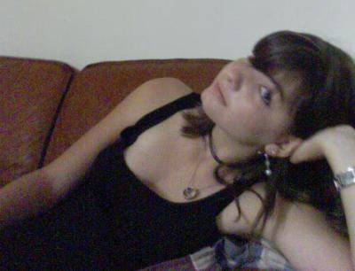

                                Kikoo !
"trop kawaï la meuf"
M'appelle Anaïs, j'ai 15 ans"ne fuyez pas ! certes mon visage est meurtri par l'adolescence, mais mon mental reste intact !".
En ce 1er Octobre, premier jour du reste de ma vie"réfléchis...oui tu peux le faire", je me décide à vous confier MON PLUS GRAND REVE"la foule est ébahie, l'emotion me submerge".

Pour mon bonheur, offrez moi des bonbons par millier ou du riz cantonais à volonté, donnez moi des vacances toutes les 2 semaines, un ordi dans ma chambre accés fermé aux fréros, un mec sublime(au hasard, Colin Farrell)... 
Si y'a rupture de stock rendez moi juste ça, ça ira.

PS : Je compte cesser de me la péter intellectuellement"voui je sais le mot c'est "pédant" mais moi c'est pas ça, enfin c'est un peu pareil mais en différent" dans mes prochains articles. 
PPS : En effet sur la photo, c'est moi, j'ai envie de booster les commentaires salauds, ouais chuis maso des fois :D.
            
