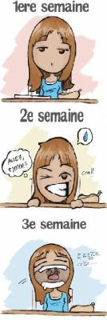

                                Là tout de suite, j'me ferais bien un grec tiens. Pitètre même un Quick "boycottons le McDo vouiiiiii".
Y'aurait pas quelqu'un de généreux prêt à bouger son cul-cul pour moi là ?

...

Bande de crevards.

Il me prend l'envie de vous raconter ma vie"comment ça vous vous en battez l'citron ?! ... :'( Z'étes content, z'avez fait pleurer une tite fille dans la fleur de l'âge. Ayez honte et soyez puni".
Bon déjà j'me pointe à 8h, POUR JOUER AU UNO parce que la prof d'histoire a omi de signaler son absence et EN PLUS il pleut, le ciel se donne un air d'apocalypse. La couleur est donnée, aujourd'hui...j'vais déprimer "incline toi devant ma rime".
Ensuite j'ai eu 12.5 en rédaction ce matin, voilà ma prof "à la connerie sans nom" n'a pas reconnu mon génie. Puisse-t-elle être mangée par des canards à son réveil. Parce que voilà prout quoi. La déprime s'accentue et je songe à noyer mes soucis dans l'alcool  "ahah".
Après avoir été engloutie par la foule devant le réfectoire "j'vous passe le détail du melting pot d'odeurs...",j'arrive au self et...je mange  "quoi, vous ne le saurez pas, les détails de ma vie privée ne vous regarde pas :p".
Bon le reste de la pause, j'ai déambulé entre la cafet' et l'entrée du lycée, il faisait froid, j'ai recopié l'anglais, j'ai écouté ma musique "chuis une référence" et là je sens que vous êtes heureux d'apprendre tout ça.
14h : Anglais. On a écouté les Pink Floyd. Youpi.
15h : Allemand. Un heure d'incompréhension.
16h : Physique. CONTROLE. Dites c'est quoi un ion ?
Dans le bus du retour, je me surprends à penser que le suicide est l'unique issue.
Et là, le pire du pire, j'arrive chez moi et ça sent LE CHOUX FLEUR. Ma Maman elle abuse des fois, mais là, c'était l'ignominie suprême.

FIN.

Pix : Merci AngeLe

.:: Guess who's back ::.
            
