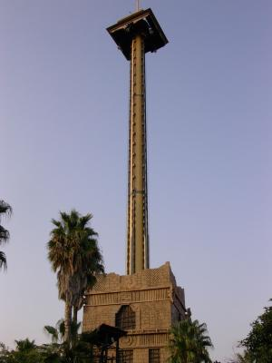

                                Port Aventura c'était... :

- en tout 12 heures de bus, aller accompagné de mon iPod chéri d'amour, ponctué de Garfield, La Belle et le Clochard II, L'Age de Glace. Hum Hum. Retour, merde, plus de batterie, merci mp3 papa Marine avec ses intégrales de Celine Dion et Eddy Mitchell""j'écoutais le disc-jockey, dans la voiture qui me traînait..." non TG Eddy". Avec en fond visuel Les Bronzés font du ski, Le Monde de Narnia et Small Soldiers... Bref, A CHIER ce bus.
- un grand 8 carrèment impressionant, une tite fille qui force une grande à monter hein poulette ?
- des "connards d'espagnols" qui payent pour t'arroser 
- une chute sensationnelle dans ZE attraction
- une peur bleue dans la maison de l'horreur, décors Resident Evil, Saw, acteurs flippants"hein Adriennn", la totale !
- des jolies balançoires ""nan mais t'as cru quoi ? j'les double les gamins, j'veux refaire un tour !""
- d'la bouffe dégueulasse...
- une drague pourrie de suisses trop moches
- nos races sur les photos après le Dragon Kahn
- "baaaah il est pas GB c'est quoi ces goûts !"
- nos bugs de prononciations
- des barres et des barres de rire...
Pour "clement" : Pas trop frustré ? Ca va, tu le vis bien ? Allez t'arrache pas tu t'fais du mal.
Et pour "K." : Merci beaucoup pour la 2nd partie du comm' :D, par contre la 1ère t'aurais pu éviter nan ? M'enfin repasse quand tu veux et contient ta rage ptdr.

Quand j'vous disais que ma photo allait booster les commentaires salauds... 
"Mythomanes sont les fans..." 

Sinon merci aux autres(anonymes ou non) qui m'font vraiment sourire, plaisir, limite vous me flattez (à différents niveaux). Vous êtes des bombes et eux des déchets radioactifs^^.
            
