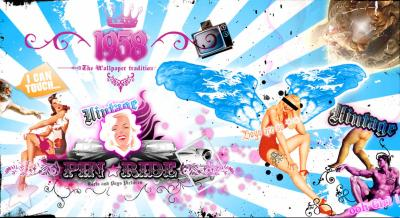

                                Stand by me - B.E King
En souvenir d'un puissant déclic qui m'a amené à la cessation de merdes auditives"quelle magnifique phrase pompeuse". Bande original du film du même nom, tout aussi jouissif^^.
| Janvier 2005 |

Sexual Healing - Marvin Gaye
J'ai découvert cette chanson grâce à la Nouvelle Star"même pas honte", j'ai mis 2 mois à me la procurer, elle est entrée dans mes différents lecteurs mp3, CDs gravés, portables même, pour ne plus JAMAIS en sortir. Du (cul)te, un rythme youhouuuu y'a pas de mots, des paroles biiien chaudes et le souvenir d'une soirée MSN...
A ceux qui ne connaissent pas : je prie pour vous chaque soir.
| Mai 2005 |

Twilight - Vanessa Carlton
Peu de gens savent c'que signifie cette chanson pour moi, ce live planant qui m'a bercée de nombreuses fois face aux étoiles"tmtc K.D.k". Bref j'm'enflamme, mais si vous saviez...
| Juillet, Aout 2005 |

Dice - Finley Quaye
Combien de fois j'ai pu faire mon quart d'heure de marche jusqu'au collège avec cette chanson dans les oreilles... Combien de fois j'ai tenté de retranscrire les paroles en cours d'histoire... 
| Juin 2006 |

I knew I love you - Savage Garden
Tmtc Vins, tmtc Riké, comment on l'a connaît par coeur, comment le silence se fait quand on l'entend, comment j'ai l'sourire quand j'repense à ces cassettes...
| De 1998 à aujourd'hui |

L'Ecole du Micro d'Argent (LP) - Iam
Parce que c'est culte, j'étais en CP que mon frère me pétait les tympans avec ça, à présent c'est ancré, même Vins qui a complétement changé d'influence musicale admet que le talent est là.
| De 1998 à aujourd'hui |

Teardrop - Massive Attack 
Celle-ci m'a accompagnée bien trop de fois dans le bus, bien trop de fois sous la pluie, bien trop de fois pour réfléchir, bien trop de fois dans la cour avec Ju. Un trop-plein bien trop agréable.
| Novembre 2005 |

Jihad - Medine
"Ma richesse est culturelle, mon combat est éternel, c'est celui de l'intérieur contre mon mauvais moi-même"
Pour ça. Si si c'est une raison.
| Tous les jours depuis Aout 2006 |

Dernière Chance - Soprano ft. Lea
Pourquoi j'aurais mis les paroles dans l'article 11 si c'était pas absolument sublime ?
| Septembre 2006 |

Et aussi...
Nara - E.S Posthumus ❤️
Katie Melua - Spider's web
Escape from Mantua - Craig Armstrong ❤️
Cloud in the sky - Archive
Evacuating London - The Chronicles of Narnia Soudtrack ❤️
Hip Hop - Hocus Pocus
Le jour où tu partiras - Oxmo Puccino ❤️
Laisse pas traîner ton fils - NTM ❤️
Thé à la menthe - La Caution
PS : "clement" je ne comprends plus là...
            
