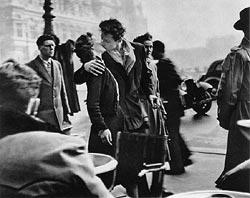

                                Ils m'exaspérent quand ils... :
- ponctuent toutes leurs phrases par des onomatopés
- se croient indispensables
- regardent le sport
- manquent d'un courage que MOI j'arrive à manifester
- imaginent connaître mes pensées
- vont jeter leurs mouchoirs avant d'effacer l'historique de leur ordi
- oublient la notion de tact
- sont idiots
- se sentent plus pisser
- se prennent pour des poètes
- pensent que tout ce qui est immoral leur est reservé
- prennent des décisions à la con (tmtc)

En revanche ils me rendent folles quand ils... : 
- prennent soin de moi
- m'appelent "princesse"
- me regardent dans les yeux
- me jurent que je suis l'unique
- me chuchotent que je suis la plus belle alors que je suis même pas maquillée ;)
- m'assurent que je suis "la meilleure chose qui leur soit jamais arrivé"
- me pardonnent tout(TOUT)
- sourient à mes bêtises
- m'embrassent à pleine bouche
- me tirent par la main sans me donner le choix
- ont l'air tellement amoureux que ma mère me dit "attention ma chérie, tu sais où tu vas ?"

J'en ai eu deux comme ça, j'ai perdu les deux, et pourtant les deux m'aiment encore... 
Et si c'était pas si compliqué, ce serait pas si excitant et à l'heure qu'il est j'me sentirais pas aussi vivante(malgré les psychosomatismes). Bien sûr y'a des moments où j'me suis sentie vivre de manière plus agréable mais...c'est déjà ça.
Pix : Robert Doisneau "Le baiser de l'Hotel de Ville". Ce fût avec plaisir "...". Qui es-tu ? :D
            
