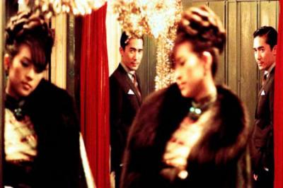

                                Si tu connais au moins 10 noms parmis cette liste, c'est bon, tu peux prétendre à être une de mes connaissances. Si tu les connais tous, il est bien évident que nous allons nous marier(si si même si t'es une fille).

Bruce Lee - Eric Clapton - Anna Gavalda - Craig Armstrong - Sofia Coppola - Marvin Gaye - Corneille - Amelie Nothomb - Che Guevara(manièèèère) - Joe Hisaishi - Michel Gondry - Melissa P. - Akh - Zach Braff - Lolita Pille - Hayao Miyazaki - Scarlett Johansson - Toucher-terre^^ - Takeshi Kitano - Nathalie Portman - Medine - Baudelaire - Muhammad Ali - J.J. Abrams - Masakazu Katsura - Robert Doisneau - Donna Summer - Sam Mendes - Vanessa Paradis - Zinedine Zidane

Après quelques commentaires et conversations, j'ai cru comprendre que l'article sur l'inauguration du premier commentaire salaud (cf [10]) avait beaucoup plu(particulièrement à la gente masculine). A croire que la seule chose que j'fais bien c'est casser ou me dénigrer. Bon j'avoue mon cass' est plus puissant que celui de Brice(enfin en général car cette vanne par exemple était pourrie). D'ailleurs comme en fait je réponds à chaque fois ben c'est tout con mais y'a plus de rageux ! C'est pas drôle...
Bref. 
Sinon je suis très contente pour la spectaculaire augmentation des visites ce week-end, continuez comme ça, rageux ou fans :p, ça m'donne envie d'écrire héhé ! 

Tout ça pour dire un putain de merci pour tous les compliments, toutes les visites, tous les commentaires et puis allez soyons fous, pour tous les rageux sur ce blog.

Selon une étude de Sk*yblog, 85% des gens ayant lu cet article auront compté le nombre de personnes qu'ils connaissent dans la liste.

PS(edit du 25/10) : Merci de m'avoir raconté ta matinée "ptite miss 3", mais en fait j'en ai grave rien foutre que tu t'emmerdes en étude, que t'as envie de ta clope et que ton amoureux t'attends(tu l'as payé cher?). La prochaine fois essaye de t'exprimer en français d'accord. Repasse quand tu veux. ❤️❤️❤️
J'ajouterais qu'en lisant les comm' rageux, j'me suis aperçue qu'ils étaient tous plein de fautes, limite illisibles avec une syntaxe pourrie et tout. J'en conclus que les rageux sur ce blog sont des autistes qui n'ont pas compris que j'me prends pas au sérieux, que j'me la raconte pour de faux, que tout mes écrits(ou presque) sont là pour occuper l'esprit de ceux que ça intérresse et non pour que vous preniez ça pour la parole de D.ieu(bien que ce soit tentant je vous l'accorde...oups j'recommence :p).
Quant à ceux qui m'ont vu me balader dans le lycée en faisant des vannes, qui croient m'avoir cerné en ayant lu mes mots et m'avoir cassé avec leur répliques de merde, sachez que... vous êtes tous des méchants. Na. PROUT. Nan sérieux, j'm'en tape.
            
