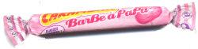

                                Jeudi 26 Octobre 
Mon portable qui n'a cessé de vibrer toute l'après-midi. Nan merde j'ai pas envie de répondre, allez on se force..."Indigènes ? Heu j'l'ai déjà vu c'est pas d'chance...". 
Putain un effort, y'a des gens que t'as négligé ces derniers temps... Naaaaaaan, veux pas, j'ai fait la grass' mat mais soirée trop fatiguante hier.
Voilà le combat qui a eu lieu dans mon esprit durant quelques heures.
Bien évidemment j'ai finalement écouté ma flemme qui se manifestait par l'appel oppressant de mon canapé. J'commence à galérer devant un téléfilm à deux balles, ouais toi aussi tu connais ça, le genre d'histoire avec une ptite fille espiégle pleine de tâches de rousseur qui tente de réunir ses parents divorcés. Je sens que j'vais pas tenir devant les facéties de la gamine alors je zappe sur la chaîne musicale. "Hey je dis stopeuhh, c'est ma beauty girl personne ne l'approcheuhh...!". Tribal King.

Morale de l'histoire : la prochaine fois je répondrais au téléphone.
 Vendredi 27 Octobre

M.E.R.C.I à V.O.U.S de me répéter cette phrase qui m'arrache un puissant sourire.
Vivement lundi, mardi, mercredi(tmtc).
Vivement le 7 et d'la house même si c'est d'la musique pourrie.
Vivement que TU me pardonnes mes silences.
Vivement que le psychopathe qui m'appelle en anonyme se décide à parler ;).
Samedi 28 Octobre

"Euh...y'a combien de Carambar à la barbe à papa ?" "sourire BG" dit le charmant vendeur.
"Normalement 10..."
"Bon j'vous fais confiance... Une poche ? C'est encombrant les Carambars..."
Bref. 

Et une trooooop bonne nouvelle aujourd'huiii !
"Eric, merci d'avoir des potes ;)"
Une journée à glander mais surtout à penser absolument positivement ! 
Dimanche 29 Octobre

*"Allez Ninis ramène ton zouk on va glandeeeerrrrr ! Rdv à 15h discute pas"
On a TOUJOURS quelque chose à se dire et le temps passe viiiiiiite quand on est ensemble.

*Là c'est bon ça va démarrer, ce soir j'travaille manièèèère et puis j'enchaîne. Heureusement que tu débarques de Pau, faut les kiffer ces 3 jours et oublier que l'été est réellement fini...

*J'ai vu un t-shirt ROUGE renter chez lui (revenant probablement du foot)...

*Ju il est épais "Pierre et Jean" ? (TMTC(ou tmts) ça veut dire "toi même tu sais")

*"Anaïs comment ils sont trop longs tes ongles..! C'est trop beau !"
"Ce sont les témoins de mon inactivité ;)"

*L'appelant anonyme a parlé !! Et cette personne est effectivement psychopathe...

*JB j'ai écouté Youssoupha(pouce vers le haut) et j'te bipe demain tkt.

*Une chanson de The Kooks tourne en boucle, j'ai honte, mais c'est trop bon. T'as remarqué que tous les groupe de rock commence par The ? The Servants, The Killers, The Cardigans... Bientôt Blink 182 et Sum 41 vont se changer en The Blinks et The Sums, on parie ? (j'entends déjà les bouffons "pfff tu fé tp vane tu ti coné, ils fon mm pa du roc eux" je sais TG, mais pour moi c'est pareil).
(oups... j'viens de me rendre compte que cette vanne a justement été faite dans un clip de Sum 41... et merde)

*Mon DM de math me nargue... "Viens, allez viens galérer devant moi... Tu vas rien comprendre on va rire..." OOOOOhhhh le vilain ! Allez j'me barre, j'vais lui montrer qu'il peut pas me test', rira bien celui qui rigole en premier(ou qqch comme ça...) !

*Paragraphe absolument destructuré et incompréhensible JE SAIS.

*Edit de 23h15 = en fait j'ai pas bossé, vous m'avez monopolisé sur msn... mais j'vais y'aller hein !
 Lundi 30 et Mardi 31 Octobre

2 journées, 2 soirées ma parole !
A base de réplique cultes :
"Enorme ! Ah non mais énooooooooorme j'te jure ! Enormissime !...'Tain j'sais plus c'que j'voulais t'dire..."
"Plaît-t-il ? Diantre ! Que nenni !"
"L'alu total, TO-TAL !"
"Je bois le lait de Maydelé (dsl j'l'ai fais phonétique hé...)"
"Si j'ai un fils, j'l'appelle Elliot. Euh nan en fait."
"Les filles j'vous préviens je ronfle et j'parle..."[ouais on a r'marqué... "sans dec' Marine, on squatte la chambre d'ton frère.."]
"J'me souviens, j'étais d*****é..." [qui remplace accessoirement le "une fois au stage d'été..."]
"Sérieux, on dit trop d'la merde là..."
"Nan mais c'est un YMCA ça !"[ma fierté personnelle]
"Ouais de toute façon j'en reprendrais" [fou rire inexpliqué] "hey mais c'était pas drôle en fait"

Tout se mélange là... "Waltergay", les Afghans(puissant sous-entendu of course), Barbe Rousse et le monologue d'Otis, l'affichage "chaîne humaine" dans la rue, nos pyjamas, les clubbeurs "partis pour la niiiiiiight", les escargots("regarde celui-là il est encore plus petit !" - "nan ça c'est une merde Marine") et pleins de trucs qui foutent la honte...
            
