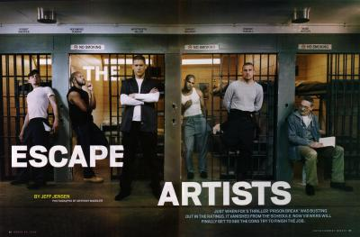

                                Des fois y'a ton frère qui te sort une blague style Carambar(chuis une grosse adepte en c'moment) et toi, connement, tu ris, ouais t'exploses d'un coup, t'es dans la rue et tu vois les regards terrifiées dans les rétroviseurs et tu t'en fous parce que t'es heureux d'avoir mal au ventre.

Des fois t'as une copine qui te demande conseil pour un garçon dont elle est accro sans se l'avouer et toi tu t'sens important, tu te jures de lui ouvrir les yeux quitte à être un peu trop sincére, pour pas qu'elle reproduise les mêmes erreurs que toi.

Des fois t'écoute une chanson, une chanson qui a été dans le top 50 de 1998 et...et tu te dis "mais où sont passés les vrais valeurs ??" parce que à l'époque la musique faisait moins sa pute(Booba à la Star Ac' MON DIEU MON DIEU MON D...).

Des fois tu mates un bogoss dans le bus, tu te dis "mais c'est qu'il est bogoss, nan me r'garde pas dans les yeux... oh bordel il a une crête le con" et à l'arrêt suivant tu vois monter une clubbeuse qui va pour l'embrasser. Là t'as plus de regrets.

Des fois t'es captivé par un blog, t'entends ta maman qui t'ordonne de quitter l'ordi sous peine de venir te déraciner, et toi t'en fiches, tu ne quitteras pas l'ordi sans avoir achevé ta lecture.

Des fois tu découvres les récents achats de quelqu'un et t'y peux rien tu te marres ! Et accessoirement tu es ravi de voir que cette personne assume enfin sa vraie nature(nan ça c'était pour le casse, compréhensible uniquement par ma personne).

Des fois tu parles à quelqu'un à qui tu t'es attaché sans t'en rendre compte, vous vous promettez(en sous-entendus) que vous serez toujours là pour vous consoler et pour la première fois vous vous dîtes au revoir avec plus d'affection.

Des fois(souvent) tu parles à quelqu'un à qui tu t'es attaché en t'en rendant très compte et t'apprécies de voir que vous allez toujours dans le même sens, que cette "amitié"bien qu'étrange, est bien réelle(ne pleure pas en lisant ça ptdr).

Des fois tu comprends tu ne parleras sûrement plus jamais à quelqu'un à qui tu tiens mais qu'après tout  c'est sa faute. Et tu penses rapidement à quelqu'un d'autre parce qu'après tout, c'est pas l'amour de ta vie que t'as perdu.
Pix : Dédicasse à l'avant dernier paragraphe ;). J'avais pas d'idées d'image, j'ai trouvé grâce à toi hihihihi. Tmtc. Mmgc.
            
