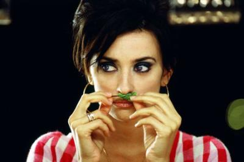

                                Nouvelle Vague - Dance with me
Oxmo Puccino - Lipopette Bar (LP)
Bran Van 3000 - Drinkin in L.A ❤️ 
 [ Spéciale dédicasse à Pierre-A......, le monsieur le plus lunatique que je connaisse, un jour c'est câlin, le lendemain c'est torture. : 
Il était une fois la classe de 506. Dans cette classe, un garçon au prénom scandaleux mais que tout le monde épargne en l'appelant seulement Pierre. Le jeune homme est brun, grand et svelte. Il écoute du rap et du rock, voui voui c'est un hybride.
Il est pourvu d'une santé fragile :p : hamster style, bad trip, grippe...(ta drogue douce quotidienne n'arrange rien, inconscient !). Récemment une peine de coeur il me semble... Mais chut.
Ses pseudos changent d'allure toutes les semaines, plus fashions les uns que les autres. Et des messages perso qui me font m'interroger.

Il est visiblement intelligent, mais une feignantise rarement rencontrée l'anime.
Un jour il m'a demandé mon adresse msn, sans doute dans l'espoir de fraterniser avec quelques personnes dans cette classe moisie. Pas bête la guêpe(...--'), j'avais mon blog en message perso. Le soir même, j'avais un véritable fan, qui n'a de cesse de me complimenter.
Pierre j'te kiffe, t'es un vrai :p . Bonne journée en ma compagnie^^ ]

N.inis La Méchante dit :
bonne soirée girouette

"bonne soirée girouette, bonne soirée girouette, bonne soirée girouette..."
Putain ça résonne, j'ai honte. Relativise, merde, tu t'en fous de c'qu'il pense. Allez ouais, je suis une folle, j'assume pleinement, prout.

"bonne soirée girouette, bonne soirée girouette..." 
            
