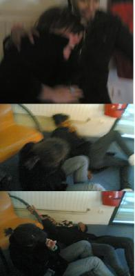

                                Pix : Et là... c'est le drame. Ju' et Jo' (Bill et Dog si tu prèf Julia, tmtc) alors en train de poser devant mon objet de culte, glissent, tombent, sombrent sa mère la raclette. Elles chutent en silence pendant un ralenti exagéré(j'ai quand même eu le temps de faire 3 photos). J'étais étouffée d'un rire muet et j'essuyais mes larmes avec mon mouchoir en tissus tout pourri. C'était culte.

"J'ai mal au cuuuul...hannnnnn aïe aïe aïe grmpkqdiyzjf (plaintes et gémissements)".Variante : "Oh mon cuuuuul" . Voilà la phrase très classe que je n'ai de cesse de répéter. Epargnez moi les sous-entendus s'il vous plaît parce que les "ohhhh ptite catin !" j'y ai droit toute la journée. Tu vois où c'est le coccyx ? Ben dessous y'a un autre os pointu un peu comme l'os du coude et c'est là que j'ai mal.
Mais cela n'a en aucun cas démolit mon moral d'acier dû à mes supers notes (11 en maths, 11.25 en physique et 16 en français...je sais je sais) et surtout AUX VACANCES.
Bref.

Il n'est jamais trop tard pour établir une liste de cadeaux : 
- a lot of money, yeahhhh always mo' moneyyyy
- un sourire greffé sur le visage de ma maman

Sur ce, mangez bien (pour moi fondue^^), riez beaucoup, soyez honnêtes ("To me you are perfect"...) bref passez un joyeux Noël.
😊 😊 😊
"Bzoo" tkt j'reste flex mais tu m'intrigues...! T'es au lycée à St Ex ? A Blagnac ? Toulouse ? T'es dans le département au moins ??! Joyeux Noël^^
            
