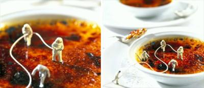

                                Mes résolutions pour 2007 (et voui parce que je suis une fille comme cela, je fait des listes et même que j'y crois très fort, peu importe que je sois la seule) :
.................... → Conserver mon iPod que j'idolâtre un peu plus chaque jour.
.................... → Ne plus bloquer personne sur msn.
.................... → Ne plus compter sur mes potes physiciens pour recopier les TP.
.................... → Limiter les McDo.
.................... → Continuer de critiquer avec cynisme, c'est ça qui est bon.
.................... → Dissuader Julia de faire des bêtises, inciter Cyrielle à agir sans réfléchir, consoler Audrey 
.........................du mieux que j'peux, aider Marine pour ses devoirs en tripant comme des baleines. 
.................... → Me motiver pour les cours de code.
.................... → Continuer les barres de rire avec Jo' et Marine.
.................... → Acheter un chien à Vincent pour qu'il arrête avec sa guitare (mais naaan j'taquine pleure 
.........................pas).
.................... → Investir dans un traducteur Français/Eric. 
.................... → Appeler régulièrement les gens à qui je tiens et que je n'vois pas tous les jours.
.................... → Faire la bise à Michael Scofield.
.................... → Arrêter de faire la sentimentale sur Bryan Adams et ses compères lovers.
.................... → Cesser de bouder parce que les sources pour Grey's Anatomy sont insuffiantes.
.................... → Améliorer toujours plus ma culture cinématographique pour faire plaisir à Guillaume.
.................... → Discuter toujours aussi longtemps avec M'sieur.
.................... → GARDER JB PARCE QUE C'EST MON POTE A LA COMPOTE.
.................... → NE PAS OUBLIER JB DANS MES RESOLUTIONS POUR 2008.
.................... → Tenter un vrai truc avec Adrian.

Bonne année à tous sauf ceux que j'aime pas, vous j'vous souhaite bien des malheurs pour pouvoir en rire. 😊
            
