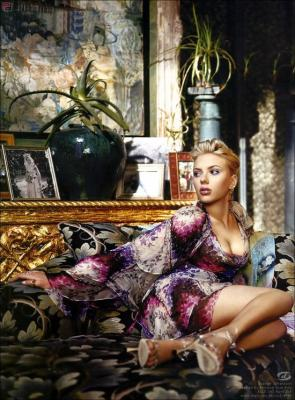

                                En espérant que chacun se reconnaîtra...

* Si tu veux on se bat, tu me claques, j'te donne un coup de genoux pour que tu te préoccupes de tes bijoux le temps que j'efface ce mail qu'IL NE FAUT PAS QUE T'ENVOIES. Réfléchis, j't'en supplie... mais fais pas ça. Ecoute moi, je sais c'que j'dis, ce qu'elle te fait je l'ai fait alors quand c'est des garçons minables ça compte pas, mais quand c'est toi, c'est innacceptable. Redeviens celui qui s'marre en écoutant "L'hymne à l'amour"(mais si cette chanson est magnifique), cesse le jeu de l'amoureux transi même s'il est sincére. Et passe à autre chose. "Mais c'est dur Anaïs, tu comprends pas". Si je comprends justement. Bien sûr c'est pas en claquant des doigts que tu parviendras à arrêter tout ça. Mais fais moi confiance.
Tu te rends compte que j'vais jusqu'à l'écrire ici ? Mieux, j'te passerais mon mot de passe, pour que tu le lises en avant première.

* Ensuite toi. Dois-je comprendre que t'abandonnes ? Chuis déçue. Triste limite. Dans mon message, j'ai fait effort, si tu l'as pas vu comme tu dis, qu'est-ce que j'peux faire ? T'aurais pu me répondre. Non...? Ca va bientôt faire 4 mois, la dernière fois j'en ai eu pour un an, désolé si la progression est lente. Mais moi je souhaitais plus que tout que ça marche alors que toi, je sais pas ce que t'en penses...

* Et le meilleur pour la fin, celui qui m'apprend des mots et qui a les yeux mordorés... 😊
J'crois que ça va plus, j'ai envie de mettre des coeurs sur mes pseudos, ça commence à craindre sérieusement. Et le pire... c'est que j'aime ça.

_________________________________________________________________________________________________

- C'est injuste quand même, l'orgasme est plus dur à atteindre pour les filles que pour les gars...
- Oui, c'est vrai que nous c'est plus facile, mais c'est aussi souvent plus dur tu sais.

- Le don de sperme c'est hyper courant en fait, c'est bien c'est un acte solidaire.
- J'crois que c'est surtout un acte solitaire.
            
