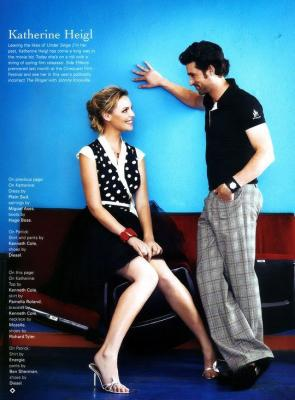

                                "Tous les hommes sont menteurs, inconstants, faux, bavards,hypocrites, orgueilleux ou lâches, méprisables et sensuels;
Toutes les femmes sont perfides, artificieuses, vaniteuses, curieuses et dépravées ;
Le monde n'est qu'un égout sans fond où les phoques les plus informes rampent et se tordent sur des montagnes de fange ;
mais il y a au monde une chose sainte et sublime, c'est l'union de deux de ces êtres si imparfaits et si affreux.
On est souvent trompé en amour, souvent blessé et souvent malheureux ; mais on aime, et quand on est sur le bord de sa tombe, on se retourne pour regarder en arrière, et on se dit:
J'ai souffert souvent, je me suis trompé quelquefois, mais j'ai aimé."

Le pire, c'est d'avoir des sentiments ambivalents. De haïr quelqu'un profondément mais de comprendre ce qui la pousse à te faire souffrir indirectement. Enculé. Si au moins j'pouvais te détester tout court. Et non moi je comprends. J'ai mal pour toi même. 
            
