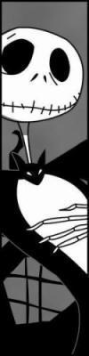

                                Comment ça, mon blog est à l'abandon ??!
Non pas qu'il ne se passe rien (au contraire !) mais qui ça regarde ? Qu'importe mon bonheur, que J. va sortir avec son S(oh l'affiche!), que P. me fasse des confidences, que j'aime Colomiers et son ambiance étrange, qu'Elephant Man m'a fait pleurer, que la B.O du film Le Roi et l'Oiseau est magnifique. Oui qu'importe.
On a quand même passé 5 semaines au lycée, on a stressé pour un devoir commun raté d'avance, on a regardé par la fenêtre de l'étude et on s'est dit pour la millième fois de l'année "Il est vraiment mort ce lycée", on s'est moqué de filles qui couraient et de gars qui jouaient les apprentis clubber, on a supporté la prof d'allemand, on s'est fait des câlins, oui des centaines, n'importe quand et pour n'importe quoi(surtout parce qu'on s'aime), la classe a rendu la prof d'histoire complétement folle(pas "on" cette fois-ci...), on s'est échangé nos iPods et on a regardé les photos des uns et des autres sur les portables, on a parlé de faire une fête, on a râté les cours parce qu'on était malade, les April 77 ont fait rage dans la classe, bref, on a partagé un peu du bon, un peu du mauvais, peut-être que je suis parmis les seules à comprendre pourquoi, tant pis. Qu'importe.
Et puis y'a eut les vacances, deux moments magnifiques, de l'ennui, des devoirs à l'arrache, des coups de 2euros40 pour le bus, un texte qui ressemble trop à ceux que je lis tous les jours, faut que j'arrête d'écrire comme ça, ça craint.
Lily Allen - Knock 'em out
Phoenix - Too young
Mark Morisson - Return of the mack
Doc Gynéco - Nirvana
Damien Rice - The blower's daughter
Ryan Adams - Wondewall
The Chronicles of Narnia - The battle
Medine - Jihad
Babyshambles - Killamangiro
(désolé, c'était pour le remplissage)
"Dis, pourquoi t'as des mouchoirs à côté de ton lit ?"
Il paraît que j'ai trop d'audace aussi.
            
