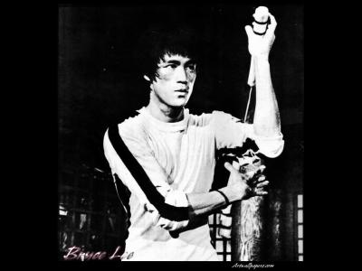

                                Rousseau se confesse, les figures de style d'Hugo nous monte à la tête, les contrôles surprises nous prennent au dépourvu (!), le contrôle commun de physique va être un désastre, on me vénère en anglais (je suis pas la soeur de mon frère pour rien).Je dors à peine sortie de cours et Imogen Heap m'aide joliment à accélérer le processus, je regarde la télé une fois par semaine et c'est le mercredi (je fais partie du petit peuple et j'assume), je passe des dimanches magnifiques, je me réveille avec quelqu'un d'improbable à mes côtés, mon portable est un don du ciel (tu peux ici remarquer une hyperbole l'ami), mon bandeau rouge donne des envies de viol (pas d'hyperbole ici en revanche...:p), Tounet joue Wonderwall à la guitare c'est magnifique, mon chéri oublie que j'ai des potes à lui dans ma classe, mes chéries c'est les plus belles et elles sont encore plus resplendissantes depuis qu'elles sont amoureuses.Il commence à faire beau, on aimerait faire cours dehors, non, on aimerait ne pas aller en cours et seulement faire les lézards, on se fout de nos notes, de toutes façons nos orientations sont acceptées, plus qu'un trimestre ensemble (seulement un trimestre, voui je vous aime mes intellectuels rebelles de 506).J'ai une admiratrice. Pas secrète."Comment t'as fait pour le rendre autant amoureux ?"On s'emporte pas les lycéennes,je parle pas de celui auquel vous pensez.Quoique... ça marche aussi pour lui :DPix = Le Dragon ❤️PS : Merci M'sieur, heureusement que t'es là.(les vrais restent)
            
