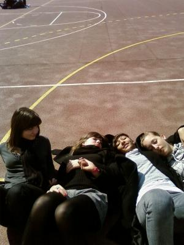

                                J'aurais bien plus de choses à dire si j'avais mal au coeur.
Désolé.
Serais-je narcoleptique ? C'est pas ça mais ça y ressemble fortement.
Je ne filtre pas vos appels, je dors, c'est tout.
Le macadam c'est le bitume.
Fini les Häagen-Dazs® aux noix de macadam.
"Attention Anaïs".
"Tu te fais dominer".
Ta mère c'est La Vache Qui Rit.
La tienne c'est le lapin Nesquik ta gueule.
Bien sûr que je l'ai mon Peter Pan.
Parce que les vrais restent.
Et que les faux se laissent pousser les cheveux. (?)
Dieu punit les méchants.
Vous verrez bien les méchants.
"ELLE EST COCUE".
"Normal, elle a une belle tête, mais à lui il lui fallait un trou aussi".
Spiderman est mon héros. (Nemo je t'aime toujours).
"With great power comes great responsibilities"

Voui, j'ai écrit une daube.
            
