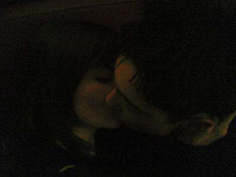

                                Et bien et bien... comme il n'est que 23h28 chez moi, je me tais pour l'instant.
Ca fait 3 mois et 2 jours :D. (Comment ça c'est pas beaucoup ? tout le monde est passé par 3 mois et 2 jours... sauf ceux qui y sont même pas arrivés :p)
J'allais commencé une phrase par "je me souviens de la première fois qu'on s'est vu" mais en fait, je m'en souviens pas donc ça risque de poser problème. En revanche je me souviens des jours qui ont suivis. Où j'me suis aperçue qu'étrangement je pensais un peu trop à toi, que tu écrivais sans fautes sur msn et que tu devais absolument cesser ce regard dans le vide qui te rendait niais à tort (mais c'est mieux que si tu louchais... ahah désolé j'ai pas pu m'en empêcher). 
Puis y'a eu le week-end où on a pas pu se voir. Là j'ai commencé à me dire que je craignais vraiment, j'ai mis un coeur dans mon pseudo et j'l'ai plus enlevé depuis.
Ensuite les vacances de Février qui ont magnifiquement commencé (je peux rien citer là :s, mais tu sais le moment qu'on attend et qui revivra parce qu'on y croit...).
Après ont commencés les aller-retours Blagnac/Colomiers, d'abord en secret, puis au final Maman a compris que ça servait à rien :p.
Il est 23h54.
Les déclarations sur un blog ça craint (on est bien d'accord hein ? par écrit ça veut rien dire). Mais bon je crois que toi tu sais.
Désolé, c'est pas vraiment le plus beau texte que j'ai écrit, mais je veux pas que les autres sachent, donc à chaque phrase je me censure, j'ose pas sortir les mots, tu sais ceux qui font comprendre qu'on a eu raison d'y croire.

JOYEUX ANNIVERSAIRE MON COEUR !! 😊
(j'te jure, je l'ai écrit en temps réel, minuit pile, regarde : *)

Donc, je te souhaite beaucoup de bonheur pour cette nouvelle année qui commence, mais vu que tu seras avec moi, t'as pas trop de souci à te faire je crois.
Je sais pas si t'as remarqué, mais presque tous tes cadeaux ont un lien avec moi... Serais-je en train de me faire une place petit à petit ?
Je pense fort à toi et espère être encore là pour tes 17 ans.
J't'embrasse fort, je suis à peu près sûre qu'on y pense en même temps là.
Je suis gnan gnan et je m'en fous, parce que c'est vraiment bon de l'être.
            
