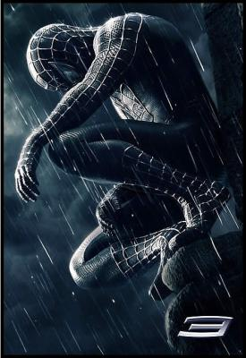

                                Sam Raimi est un génie. Il mérite tout le fric qu'il est en train de s'faire c'batard. Peter Parker nous révèle son côté sombre (symbolisé par sa méche rebelle tkt), la perte de mémoire de Harry Osborn le rend craquant, Mary-Jane Watson se fait les 2 héros, je n'ai rien de plus à dire sur cette pouffe :p.
Oui je connais tout les personnages, toute l'histoire, oui je suis fan :D.
(héééé non Guillaume, t'auras pas mon ressenti en live sur le film, fallait réfléchir un peu, pffff)

Je n'sais pas pourquoi, mais accepter en "ami" un blog s'appelant fashion-bbeyy me pose problème. Peut-être que je souhaite conserver une certaine dignité. Déjà que certains de mes favoris ont des noms de blog ridicules... (je n'en dirais pas plus car l'hypocrisie me guette). Enfin mademoiselle, tu sauras que la moindre des choses c'est de répondre à mon commentaire. D'ailleurs, pouvez-vous m'expliquer à quoi sert la fonction "ami" sur skyblog ? A rien ? C'est bien c'que je pensais.

Dernière chose : POURQUOI TOUT LE MONDE ME PARLE DE CUL ?

Ceci n'est pas un véritable article. J'écris vite fait, mais en fait, je pense à autre chose. A quelqu'un à vrai dire. Au point que la victoire de Sarkozy ne me révolte pas, elle me déçoit juste. J'ai autre chose à faire je vous dis.
            
